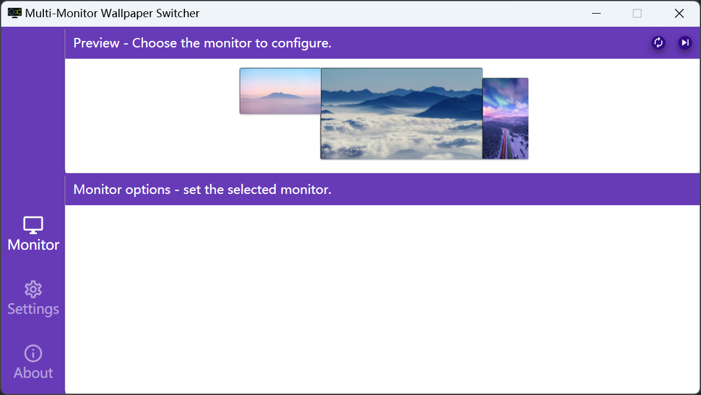

  

<h1 align="center">Multi-Monitor Wallpaper Switcher</h1>

  
  

- English
- [中文版](/README_CN.md)

> Desktop wallpaper switch auxiliary tool.

Multi-Monitor Wallpaper Switcher can be implemented as multiple monitor screen set wallpaper images respectively, and support the function of timer switch.

This tool can work on Windows8/8.1, Windows10 and Windows11 systems.

## Requirements

- [.NET 6.0 Desktop Runtime](https://dotnet.microsoft.com/en-us/download/dotnet/6.0/runtime)

## Install

Go to the [Releases](https://github.com/LightAPIs/MultiMonitorWallpaperSwitcher/releases/latest) to download the program package `zip` file unzip it, run `MultiMonitorWallpaperSwitcher.exe`.

## Preview

## Dependence

The project relies on components provided by the following open source projects:

- [FluentScheduler](https://github.com/fluentscheduler/FluentScheduler) ([BSD license](https://github.com/fluentscheduler/FluentScheduler/blob/version-5/LICENSE))
- [Hardcodet NotifyIcon for WPF](https://github.com/hardcodet/wpf-notifyicon) ([CPOL-1.02 license](https://github.com/hardcodet/wpf-notifyicon/blob/develop/LICENSE))
- [Material Design In XAML Toolkit](https://github.com/MaterialDesignInXAML/MaterialDesignInXamlToolkit) ([MIT license](https://github.com/MaterialDesignInXAML/MaterialDesignInXamlToolkit/blob/master/LICENSE))
- [Json.NET](https://github.com/JamesNK/Newtonsoft.Json) ([MIT license](https://github.com/JamesNK/Newtonsoft.Json/blob/master/LICENSE.md))
- [SQLite](https://www.sqlite.org/copyright.html)

## License

[GPL-3.0](./LICENSE) license
