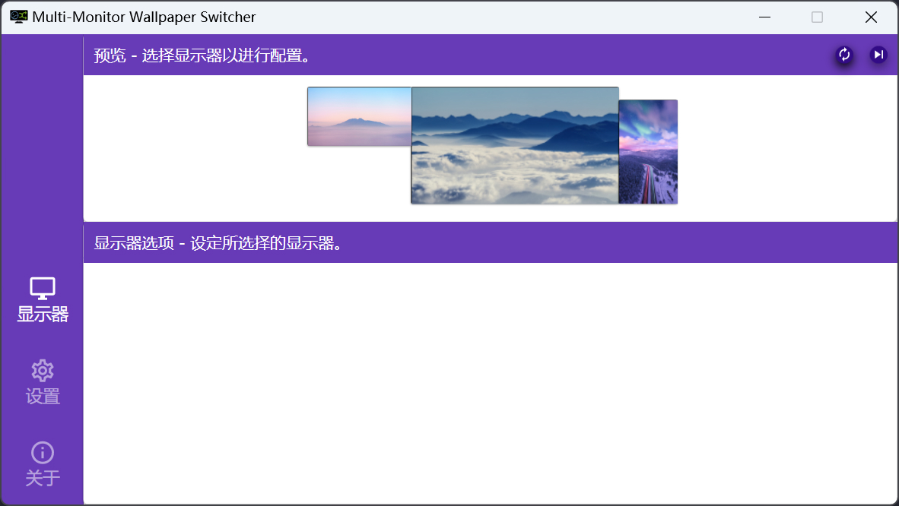

  

<h1 align="center">Multi-Monitor Wallpaper Switcher</h1>

  
  

- [English](/README.md)
- 中文版

> 桌面壁纸切换辅助工具。

Multi-Monitor Wallpaper Switcher 是一个可以实现为多个显示器屏幕分别设定壁纸图片，并支持定时切换功能的工具。

该工具可以在 Windows8/8.1、Windows10 和 Windows11 系统上工作。

## 预览

## 运行需求

- [.NET 6.0 桌面运行时](https://dotnet.microsoft.com/zh-cn/download/dotnet/6.0/runtime)

## 下载安装

前往 [Releases](https://github.com/LightAPIs/MultiMonitorWallpaperSwitcher/releases/latest) 下载程序压缩包 `zip` 文件并解压，运行 `MultiMonitorWallpaperSwitcher.exe` 程序即可。

## 依赖

该项目依赖以下开源项目提供的组件：

- [FluentScheduler](https://github.com/fluentscheduler/FluentScheduler) ([BSD license](https://github.com/fluentscheduler/FluentScheduler/blob/version-5/LICENSE))
- [Hardcodet NotifyIcon for WPF](https://github.com/hardcodet/wpf-notifyicon) ([CPOL-1.02 license](https://github.com/hardcodet/wpf-notifyicon/blob/develop/LICENSE))
- [Json.NET](https://github.com/JamesNK/Newtonsoft.Json) ([MIT license](https://github.com/JamesNK/Newtonsoft.Json/blob/master/LICENSE.md))
- [Material Design In XAML Toolkit](https://github.com/MaterialDesignInXAML/MaterialDesignInXamlToolkit) ([MIT license](https://github.com/MaterialDesignInXAML/MaterialDesignInXamlToolkit/blob/master/LICENSE))
- [XamlBehaviors for WPF](https://github.com/Microsoft/XamlBehaviorsWpf) ([MIT license](https://github.com/microsoft/XamlBehaviorsWpf/blob/master/LICENSE))
- [SQLite](https://www.sqlite.org/copyright.html)

## License

[GPL-3.0](./LICENSE) license
